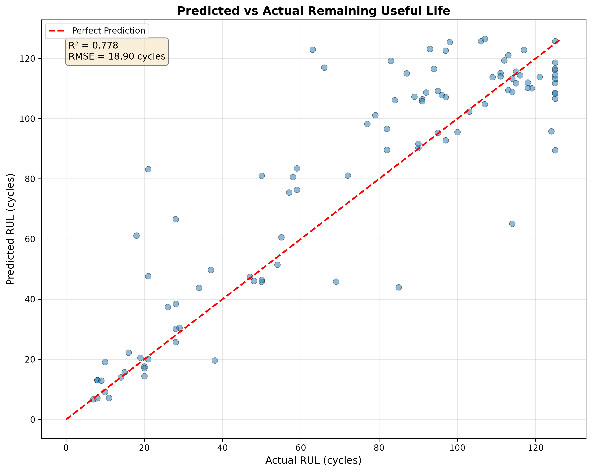
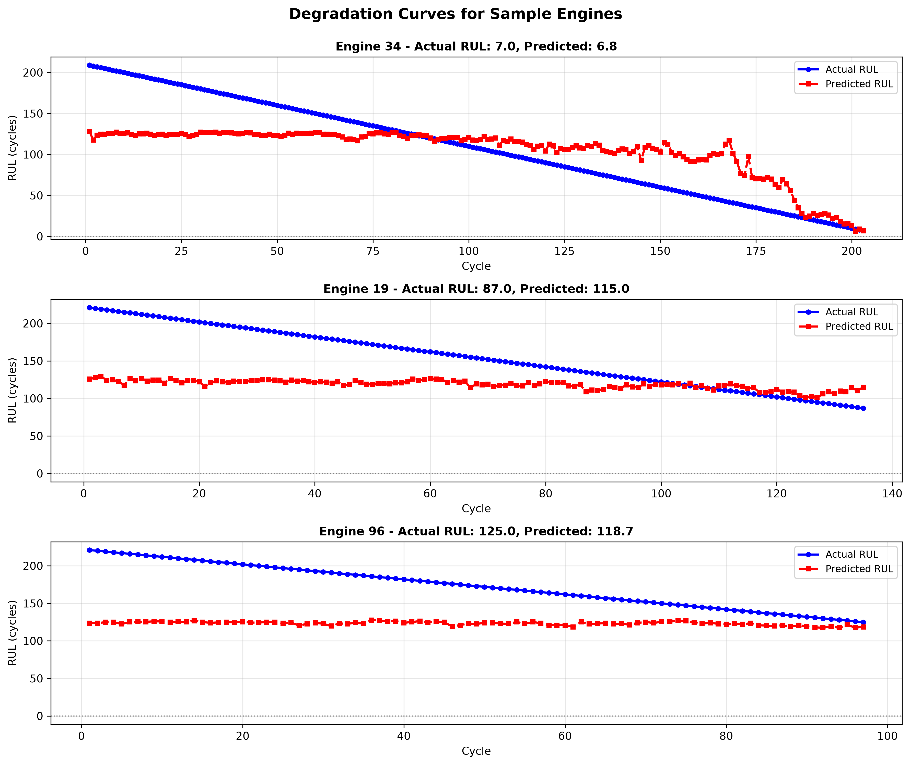

# ENGINE HEALTH MONITOR
### Turbofan Remaining Useful Life Prediction | NASA C-MAPS FD001


## Motivation

During my aviation maintenance internship at Tunisair Technics, I worked alongside senior engineers on Airbus A320 and A330 systems. In the engine workshop, I observed CFM56 turbofan engines — the same engine family modeled in this dataset — during overhaul procedures. What struck me was how much maintenance scheduling still relied on fixed intervals rather than actual engine condition. This project is my attempt to understand and implement the data-driven alternative: predicting when an engine actually needs attention, not when the calendar says so.

## Technical Overview

This system implements a supervised regression model for turbofan engine remaining useful life (RUL) prediction using NASA C-MAPS degradation data. The model processes 21-channel sensor time-series data through variance-based feature selection, temporal aggregation via rolling statistics, and normalization to produce 55 engineered features per observation. An XGBoost regressor trained on 100 run-to-failure engine trajectories predicts RUL with 18.90 cycle RMSE on held-out test engines. A Streamlit-based monitoring interface provides real-time health status visualization, sensor trend analysis, degradation trajectory plotting, and fleet-wide status overview with sortable metrics.

## Model Performance

| Metric | Value |
|--------|-------|
| RMSE | 18.90 cycles |
| R2 Score | 0.78 |
| Within ±10 cycles | 55% |
| Within ±20 cycles | 77% |
| Training samples | 20,631 |
| Test engines | 100 |
| Feature count | 55 |

## Live Demo

[Engine Health Monitor — Live Dashboard](https://cmaps-predictive-maintenance.streamlit.app)

## Results





## Methodology

### Data Engineering

NASA C-MAPS FD001 dataset. 100 engines instrumented with 21 sensors across full degradation lifecycle. RUL computed as max_cycle - current_cycle, capped at 125 cycles (piece-wise RUL normalization — standard practice in prognostics literature).

### Feature Engineering

Variance analysis removed 13 constant sensors. 11 informative sensors retained. Rolling statistics (mean and std, windows 5 and 10 cycles) computed per engine unit to capture temporal degradation patterns. MinMaxScaler fitted on training data only — no data leakage.


### Model

XGBoost Regressor. 300 estimators, max_depth 6, learning_rate 0.05. Trained on 20,631 samples. Evaluated on 100 held-out engines against NASA-provided ground truth RUL values.

### Monitoring Interface

Streamlit dashboard with real-time engine health status, sensor trend analysis, degradation trajectory, and fleet overview table — sortable by remaining useful life.

## Industry Context

This project implements the same fundamental approach used in production systems like AVIATAR by Lufthansa Technik, which serves 120+ customers and 11,000+ aircraft with predictive health analytics. While AVIATAR operates at fleet scale with live telemetry integration, this research implementation demonstrates the core methodology: sensor-based degradation modeling and RUL forecasting using supervised learning on run-to-failure data. The techniques applied here — temporal feature engineering, tree-based regression, and condition-based monitoring — are directly transferable to operational MRO decision support systems.

## Repository Structure

```
cmaps-predictive-maintenance/
├── src/
│   ├── data_loader.py           # Dataset loading and RUL computation
│   ├── feature_engineering.py   # Sensor selection and rolling features
│   ├── model.py                 # XGBoost training and evaluation
│   └── evaluate.py              # Performance metrics and visualizations
├── app.py                       # Streamlit monitoring dashboard
├── data/                        # NASA C-MAPS FD001 files (not tracked)
├── models/                      # Trained model artifacts (not tracked)
├── results/                     # Evaluation plots
└── requirements.txt
```

## Setup

```bash
git clone https://cmaps-predictive-maintenance.streamlit.app
cd cmaps-predictive-maintenance
python -m venv .venv
source .venv/bin/activate
pip install -r requirements.txt

# Add NASA C-MAPS FD001 files to data/
# train_FD001.txt, test_FD001.txt, RUL_FD001.txt

python src/model.py      # Train model
streamlit run app.py     # Launch dashboard
```

## Dataset

NASA Commercial Modular Aero-Propulsion System Simulation (C-MAPS). FD001 subset: single operating condition, HPC degradation mode. Source: NASA Prognostics Data Repository.

## Author

**Rayhane Nouri**  
Electrical Engineering Student, ENSIT Tunisia  
[LinkedIn](https://www.linkedin.com/in/rayhane-nouri-es-engineer/) · [GitHub](https://github.com/rayhanenouri)

---

*This project was developed as part of an engineering internship exploration into data-driven predictive maintenance for aerospace applications.*
